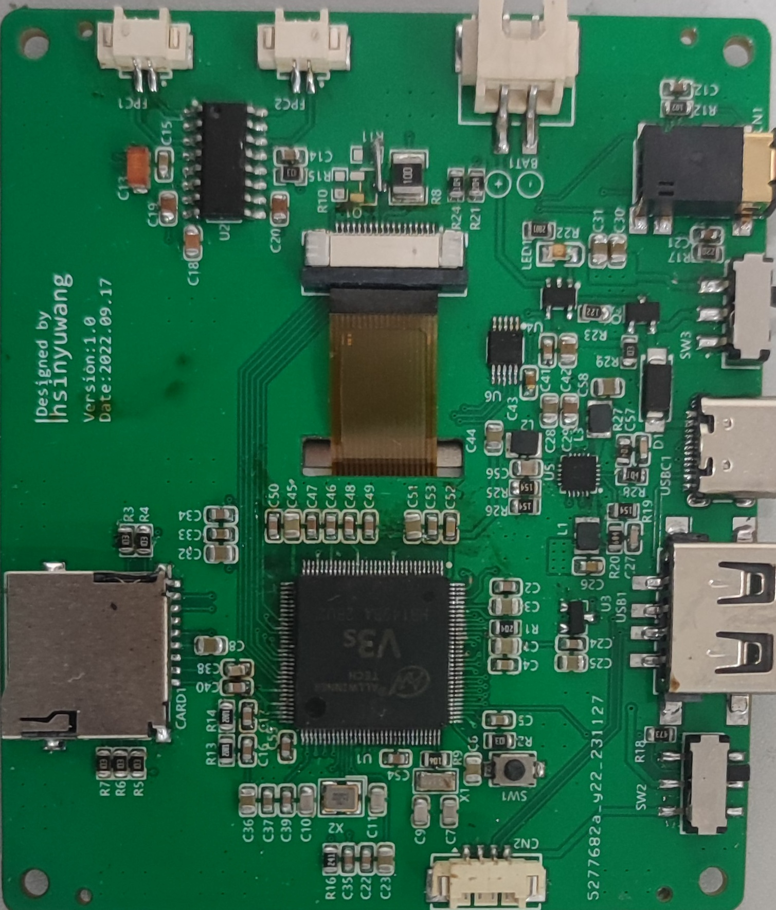
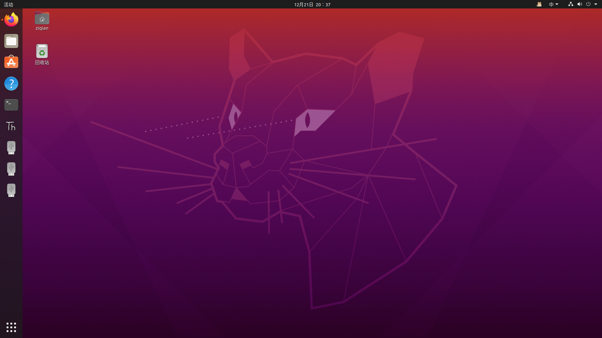

## 焊接指南

在嘉立创打样时，需要打印**1.2mm**厚度的PCB板，否则在拼装时接口和外壳会导致错位。如果有条件可以开钢网，这样更好焊接。

到了焊接环节，由于 v3s 对电源质量要求比较高，需要通过3路不同的电压供电，所以第一个焊接部分的应该是 EA3036C（或 EA3036），确认输出电压正常后才能进行下一步的焊接。经过测试，发现 EA3036 和 EA3036C 均可驱动电路，所以建议选择便宜的 EA3036C。

刷好锡膏后，将电阻、电容、二极管、三极管、CH340等贴在焊盘上，用热风枪或者加热台将其焊接好即可。然后使用电烙铁焊接 v3s 芯片和开关，最后焊接各种接口。

焊接完成，确认 VCC 和 GND 之间没有短路后，即可将 Type-C 接口连接上电脑，看看串口是否正常识别。如果安装了驱动却没有正常识别出串口，需要检查电源部分是否正常输出电压。



## 系统编译、烧录

如果不会编译内核、设备树，可以直接使用作者提供的镜像

```
百度网盘

链接：https://pan.baidu.com/s/1ftacGCXHLy-AFabczBg3yg
提取码：9bp8
```

> 如果烧录完成后发现 fat 分区比较小，这是正常的
>
> 可以使用 gparted 将扩大分区，记得格式化为 fat32 这样便可以在 linux 和 windows 下添加游戏

### TF卡分区注意事项

编译好后对TF卡进行分区，需要分出来三个分区。可以使用命令行，也可以使用 gparted。

第一个分区格式化为 ext4 格式 ，大小为32MB，存放内核、设备树；

第二个分区格式化为 ext4 格式，大小不小于1024MB即可；

第三个分区格式化为 fat32 格式，使用剩下全部空间即可。

需要确保三个分区都能挂载在linux系统上，否则不能烧录内核以及设备树



使用以下命令查看挂载的地址

```
df -h
```

### 模拟器的编译

仓库地址：https://github.com/hsinyuwang/gpsp/tree/main

```
cd ~/v3s
git clone https://github.com/hsinyuwang/gpsp.git

cd gpsp/xboy/
```

需要修改 Makefile 才能编译，编译失败的原因是 Makefile 中两处的路径和出现了问题

编译完成后复制可执行文件，需要注意的是：gba_bios.bin 需要自行下载，gpsp文件夹下还需要 font_small.ttf 和 font.ttf 文件

### 片上linux系统的配置

在对系统进行配置的过程中，`/etc/inittab`应当配置为：

```
# /etc/inittab
#
# Copyright (C) 2001 Erik Andersen <andersen@codepoet.org>
#
# Note: BusyBox init doesn't support runlevels.  The runlevels field is
# completely ignored by BusyBox init. If you want runlevels, use
# sysvinit.
#
# Format for each entry: <id>:<runlevels>:<action>:<process>
#
# id        == tty to run on, or empty for /dev/console
# runlevels == ignored
# action    == one of sysinit, respawn, askfirst, wait, and once
# process   == program to run

# Startup the system
::sysinit:/bin/mount -t proc proc /proc
::sysinit:/bin/mount -o remount,rw /
::sysinit:/bin/mkdir -p /dev/pts /dev/shm
::sysinit:/bin/mount -a
::sysinit:/sbin/swapon -a
null::sysinit:/bin/ln -sf /proc/self/fd /dev/fd
null::sysinit:/bin/ln -sf /proc/self/fd/0 /dev/stdin
null::sysinit:/bin/ln -sf /proc/self/fd/1 /dev/stdout
null::sysinit:/bin/ln -sf /proc/self/fd/2 /dev/stderr
::sysinit:/bin/hostname -F /etc/hostname
# now run any rc scripts
::sysinit:/etc/init.d/rcS

# Put a getty on the serial port
#console::respawn:/sbin/getty -L  console 0 vt100 # GENERIC_SERIAL
ttyS0::respawn:-/bin/sh
tty0::respawn:-/bin/sh

# Stuff to do for the 3-finger salute
#::ctrlaltdel:/sbin/reboot

# Stuff to do before rebooting
::shutdown:/etc/init.d/rcK
::shutdown:/sbin/swapoff -a
::shutdown:/bin/umount -a -r
```

建议最后配置该项，不然容易导致之后的配置变成乱码，命令行也不能正常使用。

## 启动gba模拟器

如果之前的都没问题，启动游戏后出现 “No gamepad found!”，那么需要在格式化为 fat32 的盘上**新建名为 gba 的文件夹**，放入游戏，并且**接入手柄**。

手柄上的stm32f103也需要烧录程序，在此不过多介绍。

最后，摸索一下 xbox 的键位分布即可开始游戏。